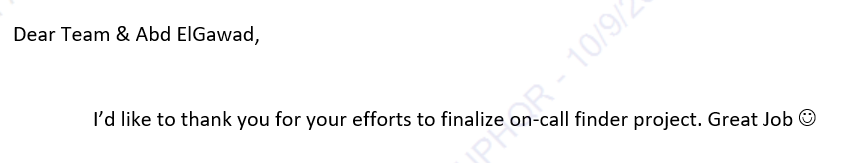

<!-- PROJECT SHIELDS -->
<!--
*** I'm using markdown "reference style" links for readability.
*** Reference links are enclosed in brackets [ ] instead of parentheses ( ).
*** See the bottom of this document for the declaration of the reference variables
*** for contributors-url, forks-url, etc. This is an optional, concise syntax you may use.
*** https://www.markdownguide.org/basic-syntax/#reference-style-links
-->

[![LinkedIn][linkedin-shield]][linkedin-url]

<!-- PROJECT LOGO -->
 

    

  <h3 align="center">On-Call Contact Finder Web Application</h3>

<!-- TABLE OF CONTENTS -->

  
Table of Contents

  <ol>
    <li>
      <a href="#about-the-project">About The Project</a>
      <ul>
        <li><a href="#business-case">Business Case</a></li>
        <li><a href="#technical-solution">Technical Solution</a></li>
        <li><a href="#feedback">Feedback</a></li>
        <li><a href="#tech-stack">Tech Stack</a></li>
      </ul>
    </li>
    <li><a href="#contact">Contact</a></li>
  </ol>

<!-- ABOUT THE PROJECT -->
## About The Project

* Project Name: On-Call Contact Finder Web Application
* Version: v1.0.0
* Organization Department: Technology

### Business Case

Members of the Patch Management team without VPN access faced challenges in contacting on-call team members during maintenance windows. This inability to reach internal extensions hindered their operations, especially when immediate communication was crucial.

### Technical Solution

The web application automates the process of retrieving contact information for on-call team members:

* **User Input:** The user enters the team's extension number into the application.
* **Database Query:** The application queries the internal database to obtain the MSISDN (mobile number) of the current on-call team member associated with the provided extension.
* **Result Display:** The MSISDN is presented to the user for immediate contact.

* **No On-Call Found:** If no on-call member is found for the input extension, the application notifies the user accordingly.

* **Exception Handling:** In case of a database query exception, the application displays debugging information and prompts the user to send an email with a screenshot for support.

This solution streamlines communication during critical maintenance activities, enhancing operational efficiency by ensuring team members can quickly reach the necessary contacts without VPN access.

(<a href="#readme-top">back to top</a>)

### Feedback

(<a href="#readme-top">back to top</a>)

### Tech Stack

This project was developed using the following tech stacks:

* Python
* Django Framework

(<a href="#readme-top">back to top</a>)

<!-- CONTACT -->
## Contact

Mohamed AbdelGawad Ibrahim - [@m-abdelgawad](https://www.linkedin.com/in/m-abdelgawad/) - <a href="tel:+201069052620">+201069052620</a>

(<a href="#readme-top">back to top</a>)

<!-- MARKDOWN LINKS & IMAGES -->
<!-- https://www.markdownguide.org/basic-syntax/#reference-style-links -->
[linkedin-shield]: https://img.shields.io/badge/-LinkedIn-black.svg?style=for-the-badge&logo=linkedin&colorB=555
[linkedin-url]: https://www.linkedin.com/in/m-abdelgawad/
